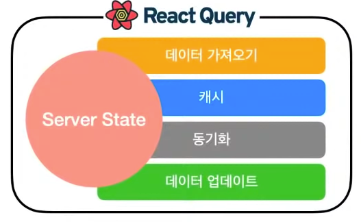

회사업무로 레거시 리팩토링을 하게 되었다. 기존 상태관리는 react-redux로 되어있다. toolkit으로의 업데이트와 새로운 상태관리 시스템 중 새로운 상태관리 시스템으로 마이그레이션하기로 결정하였다. 마이그레이션 중 만나게 된 몇가지의 문제점이 되었던 코드와 수정후의 코드를 비교해보고 왜 상태관리가 프론트엔드 취업시장에서 필수요건이 되었는 지 파악해보자

# 복잡한 상태관리

현재 개발중인 어플리케이션은 redux로 상태관리를 하고 있다. components 사이의 과한 props drilling을 피하고 상태를 공유하기 위해 쓰고 있는 것으로 보인다. 하지만 아키텍쳐구조를 생각하지 않고 여기저기에서 사용한 전역상태(store)와 자식 컴포넌트에서 전역상태를 참조하여 구현된 사이드이펙트를 발생시키는 비즈니스 로직, 역할이 분명하지 않은 container, view 단은 어느 곳에서 상태를 처리하고 있는 지 전역으로 공유되고 있는 상태를 도대체 어디서 어떻게 받아오고 처리를 하는 지 알 수 없게 한다.


# 리덕스는 왜 한계에 부딪혔는가

리덕스는 대부분의 클라이언트 상태처리를 Store에 저장함으로서 안전하게 관리할 수 있었다. 하지만 대부분 프론트엔드에서는 서버에서 오는 상태를 저장하고 그 정보를 여러컴포넌트에서 처리함으로써 어플리케이션을 설계하게 되는 데 여기서 문제점이 발생한다.
바로 리덕스의 설계철학 중 하나인 _"진실의 원천은 하나"_ 는 진짜일까. 대부분의 서버 데이터는 언제든지 mutate될 수 있기 때문에 클라이언트에 저장된 상태가 진실의 원천이라고 볼 수 없다. 이러한 문제점에서 나온 상태관리 시스템들이 채택하고 있는 전략이 [stale-while-revalidate](https://web.dev/stale-while-revalidate/) 이다. react-query, swr도 역시 이 전략을 사용하고 있다.

## 상태와 상태관리를 정의하다

먼저, 상태관리 시스템 전체를 바꾸기 전 팀원들과의 미팅으로 상태와 상태관리를 정의하는 시간을 가졌다.

상태란,

- 상태는 주어진 시간에 대해 시스템을 나타내는 것 **(언제든지 변경가능)**
- 시간에 따라 언제든지 변경될 수 있는 시스템의 스냅샷

상태관리는,

- 시간에 따라 변화하는 상태 또는 유저의 조작에 의해 변하는 상태를 관리하는 방법

React의 자체적인 상태관리 방법으로는

- 부모 -> 자식으로 향하는 단방향 props 바인딩
- contenxt api

외부 라이브러리를 통한 방법

- redux
- mobx
- recoil
- react-query , swr

등이 있으며, 굳이 하나만 사용하기 보다는 때에 따라 하나 혹은 두개의 조합으로 상태를 관리할 수 있다.

## React Query를 필두로 한 stale-while-revalidate 의 상태관리

이러한 전략을 가진 상태관리 툴들은 상태는 어떻게 나누고 있는가? 핵심은 해당 데이터의 오너쉽(제어권)이 어디에 있냐는 질문에서 시작한다.

### Client State - 제어의 권한이 클라이언트 자체에 있는 경우

클라이언트 상태는 다음과 같은 특성을 가진다

1. client 에서 소유하며 온전히 제어가능하고
2. 초기값 설정이나 조작에 제약사항이 없고
3. 다른 사람들과 공유되지 않으며 client 내에서 UI/UX 흐름과 사용자의 인터렉션에 따라 변함
4. Client 내에서 항상 최신 상태로 관리가 된다 (즉, stale한 상태가 될 수 없다)

### Server State - 제어의 권한이 외부(서버)에 있는 경우

서버의 상태의 특성은 다음과 같다.

1. client에서 제어하거나 소유되지 않은 원격의 공간에서 관리되고 유지가 된다 (DB,Backend)
2. Fetching/Updating에 비동기 API가 필요하다
3. 다른 사용자들과 공유되는 것으로 사용자가 모르게 변경될 수 있다.
4. 신경쓰지 않는다면 잠재적으로 Out of Date (stale) 해질 수 있다.

# React-Query를 사용하기



```js {4,10-12,21,24-29}
import { useQuery, useMutation, useQueryClient, QueryClient, QueryClientProvider } from "react-query";

// Create a client
const queryClient = new QueryClient();

// 쿼리 클라이언트를 제공하는 Provider를 선언해야 한다
function App() {
  return (
    // Provide the client to your App
    <QueryClientProvider client={queryClient}>
      <Todos />
    </QueryClientProvider>
  );
}

function Todos() {
  // Access the client - 클라이언트 자제에 접근한다.
  const queryClient = useQueryClient();

  // Queries - 하나의 쿼리는 이렇게 가지고 온다
  const query = useQuery("todos", getTodos);

  // Mutations - 뮤테이션이 발생하면 성공하면 todos를 썩은 데이터로 만드는 것
  const mutation = useMutation(postTodo, {
    onSuccess: () => {
      // Invalidate and refetch 썩은 데이터가 된 todos는 query가 실행되어 다시 받아온다.
      queryClient.invalidateQueries("todos");
    },
  });

  return (
    <div>
      <ul>
        {query.data.map((todo) => (
          <li key={todo.id}>{todo.title}</li>
        ))}
      </ul>

      <button
        onClick={() => {
          mutation.mutate({
            id: Date.now(),
            title: "Do Laundry",
          });
        }}
      >
        Add Todo
      </button>
    </div>
  );
}

render(<App />, document.getElementById("root"));
```

이하 자세한 설명은 [react query doc](https://react-query.tanstack.com/)을 참고하면 된다

# Migration의 결과

우리팀은 리액트 쿼리의 도입으로 다음과 같은 문제를 해결할 수 있었다.

- 서버상태와 클라이언트 상태를 분리하여 Client 상태가 명확해짐.
- devtool을 이용해 cache가 필요한 상태를 찾아 최적화 함.
- Api 호출을 통합하고 개별 loading을 사용해 전역로딩을 최소화해서 편한 UX로 개선.
- react-query의 다양한 기능을 활용해 사용성 좋은 UX로 개선.

# 부작용은 없을까요?

react query를 도입하며 좋았던 부분이 UX라면 고민이 많은 부분은 component가 이렇게 비대해 져도 되나? 라는 질문을 던지게 되었다. 하나의 컴포넌트가 비대해 지면서 다시 container presentational 패턴으로 돌아가야 하나라는 생각도 했다. 하나의 컴포넌트가 hook을 사용하게 되면서 팀원들끼리 공유할 만한 best practice를 찾는 과정이 남았다.

# 결론

프론트엔드에서 가장 중요한 상태관리의 중요성을 몸으로 깨닫고 개선하는 경험을 했다. State Flow가 명확하지 않은 상태는 유지보수 하기 힘들며 시간이 지날 수록 새로운 상태들로 비대지는 것을 눈으로 보았다. 개발부채를 적절한 시기에 해소하는 것의 중요성과 그 이전에 조금 더 확장성 있는 구조와 빠른 개발 사이를 적절하게 매니징할 수 있는 기술력을 가져야겠다고 생각했다.

# 이후 시간이 흘러

이후 시간이 흘러 새로운 글을 쓰게 되었습니다. 해당 글에서 최신화된 내용도 함께 읽어주세요.
[tanstack-query](https://myblogmain66592.gatsbyjs.io/blog/2022/12/1/tanstack-query/)

## 참고

- [stale-while-revalidate](https://web.dev/stale-while-revalidate/)
- [우아한테크 2월 React Query와 상태관리](https://www.youtube.com/watch?v=MArE6Hy371c)
- [React Query 공식](https://react-query.tanstack.com/)
