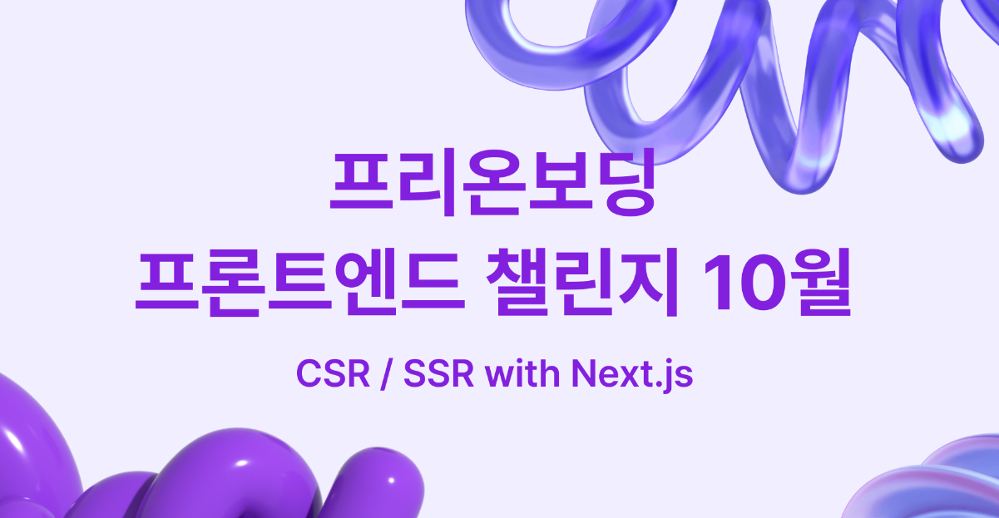

# 들어가는말

회사 프로젝트를 nextjs로 빌드하고 있다. React에서 B2B Sass 프로젝트를 진행해온터라 그다지 필요하지 않았던 SSR 기술이 B2C 서비스를 시작하며 필요하게 되었다. 그러던 와중 프리온보딩 챌린지를 발견하고 마지막날(사실 회사프로젝트도 이번주가 마감이다.) 급하게 신청서를 넣고 사전과제를 참여하는 중이다.

- CSR
- SSR
- NextJS

에 대해서 사전수행하여

# CSR

# SSR

# NextJS

## 참고

- [Axios - 인터셉터](https://axios-http.com/kr/docs/interceptors)
- [zig song님의 포스트중 aixos관련내용](https://zigsong.github.io/2021/08/19/wtc-lv3-log-1/#%EC%9A%B0%ED%85%8C%EC%BD%94-Lv3-%ED%95%99%EC%8A%B5%EB%A1%9C%EA%B7%B8-%EC%82%AC%EC%9A%A9-%EB%9D%BC%EC%9D%B4%EB%B8%8C%EB%9F%AC%EB%A6%AC-%EC%A0%95%EB%A6%AC)
