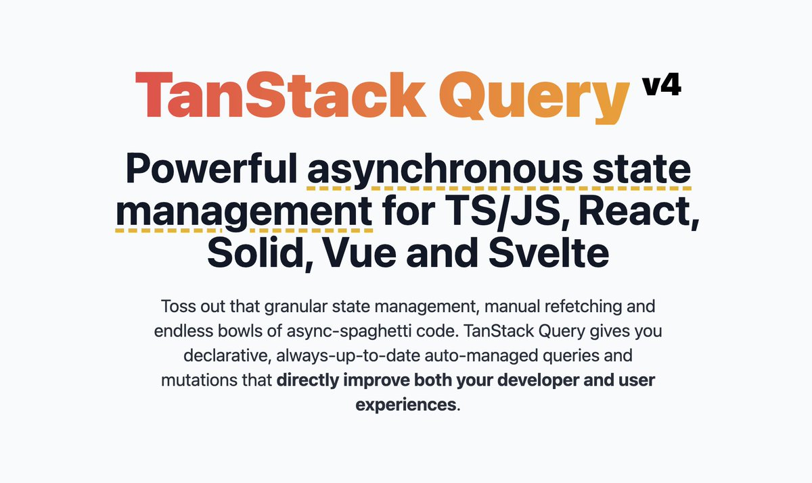

# 상태관리 트렌드의 변화



지난 3월 사내에서 React query 관련한 세션을 진행한 이후 프론트엔드의 개발환경도 빠르게 변한 것 같다. 이제는 신입개발자도 서버상태와 클라이언트 자체의 상태를 구분해야 한다고 말할 정도다. react query를 필두로한 서버상태를 관리하는 라이브러리들이 많아 졌고 swr 같은 라이벌도 굉장히 작은 용량을 앞세워 장점을 어필하고 있다. redux도 트렌드에 맞게 toolkit-query를 업데이트하며 트렌드를 반영하고 있다.
그 중 대장격인 tanstack query를 이용하며 팀원들의 잘못된 사례를 소개하고 좋았던 use case를 소개하려고 한다.

# 관리하고 있는 query 가 썩었다는 사실을 알려주자


과거 mutaion 할때마다 직접 queryClient의 데이터에 접근해서 set하는 방식을 쓰는 방식으로 코드를 짜는 팀원이 있었다. 해당 데이터에 여러유저가 접근할 경우 자기자신이 변경한 데이터만 볼 수 있게 되는 버그가 발생해서 수정을 한 적이 있는 데, 공식문서의 [Invalidations from Mutations](https://tanstack.com/query/v4/docs/react/guides/invalidations-from-mutations) 섹션을 보지 않은 것 같았다. mutaion을 하고 관련된 데이터를 수동으로 invalid 시켜줌으로 새로운 데이터를 받을 수 있었다.

tanstack query의 철학(서버데이터의 경우 진실의 원천은 서버데이터이고 client는 잠시 보관하고 있는 상태)으로 인해 optimistic update는 추천하지 않는다고 한다. 나의 경우에는 단독으로 접근할 수 있는 데이터에 유저의 변경이 대부분의 경우에 성공이 보장되는 경우 적절하게 optimistic update를 적용하여 호출을 줄일 수도 있었다.
~~그 당시에는 optimistic update를 추천하지 않는다는 것을 몰랐던 것 같다~~

```ts
import { useMutation, useQueryClient } from "@tanstack/react-query";

const queryClient = useQueryClient();

const mutation = useMutation({
  mutationFn: addTodo,
  onSuccess: () => {
    queryClient.invalidateQueries({ queryKey: ["todos"] });
    queryClient.invalidateQueries({ queryKey: ["reminders"] });
  },
});
```

# Query Client는 상태관리자의 역할을 할 수 있다.

queryclient를 상태관리자로 사용하는 코드다. 먼저 받아온 데이터가 있다면 그 데이터를 변환하여 initial data로 사용할 수 있다. 나의 경우 일부 ui를 미리 받아온 데이터로 그리고 나머지 부분을 detail api로 요청하여 나머지를 그리는 방식으로 ux 향상을 할 수 있었다.
[initial-data-from-cache](https://tanstack.com/query/v4/docs/react/guides/initial-query-data#initial-data-from-cache)

```ts
const result = useQuery({
  queryKey: ["todo", todoId],
  queryFn: () => fetch("/todos"),
  initialData: () => {
    // Use a todo from the 'todos' query as the initial data for this todo query
    return queryClient.getQueryData(["todos"])?.find((d) => d.id === todoId);
  },
});
```

# QueryKey를 Array로 해야하는 이유

tanstack query v4로 넘어오면서 생긴 가장 큰 변경점은 querykey를 object로 선언해야 한다는 것이다. 다음은 QueryKey를 배열로 관리했을 때 장점을 보여주고 있다. `[TODOS_QUERY_KEY, 'list']` 를 invalidate 한다면 그 하위의 모든 query key로 구성된 데이터들이 inalidate 된다.

```ts
const TODOS_QUERY_KEY = "todos";

export const todoCache = {
  getTodos: (filter = "all") => [TODOS_QUERY_KEY, "list", filter] as const,
  getTodo: (id) => [TODOS_QUERY_KEY, "detail", id] as const,
};
```

```ts
function useUpdateTitle() {
  return useMutation(updateTitle, {
    onSuccess: (newTodo) => {
      queryClient.setQueryData(todoCache.getTodo(newTodo.id), newTodo);
      // ✅ just invalidate all the lists
      queryClient.invalidateQueries(["todos", "list"]);
    },
  });
}
```

# useQuery를 한번더 감싸는 query hook

useQuery를 사용해서 사용자 입맛에 맞는 커스텀 훅으로 만들 수 있습니다. 아래는 기능을 추가한 custom query hook 입니다

| defaultOptions에 useErrorBoundary를 true로 설정하였지만, 해당 값은 onError 옵션 값 여부에 따라 필요하지 않을 수 있습니다. 이런 부분을 매번 options 값을 확인하고 false로 설정하는 작업은 불필요할 수 있고, 휴먼에러가 생길 수 있기에 useQuery를 감싸서 처리하는 방식으로 변경하였습니다.

[kakao tech - query 적용기](https://tech.kakao.com/2022/06/13/react-query/)

```ts
import { useQuery as useQueryOrigin } from "React Query";

export default function useQuery(queryKey, queryFn, options = {}) {
  const { onError } = options;

  return useQueryOrigin(queryKey, queryFn, { ...options, useErrorBoundary: !onError });
}
```

# mutate 와 query를 분리해서 사용하기

[context hook best practice](https://levelup.gitconnected.com/react-context-the-definitive-guide-to-best-practices-fd095568be03)의 개념을 이용해 query를 구독하고 있는 컴포넌트를 줄이고 control api로 나눠서 관리할 수 도 있습니다.

control api로 나누지 않고 아래와 같이 custom hook을 구성할 경우 addAddress Mutation을 단독 사용해야할 경우는 query dev tool에서 구독하고 있는 컴포넌트의 갯수가 계속해서 늘어나는 경우가 있다. 만약 mutation만 단독으로 사용할 케이스가 만다면 query 로직과 mutaion을 나누는 것도 가능하다. 그 외 특별한 경우가 아니라면 아래와 같이 hook의 갯수를 줄이는 것도 가능하다.

```ts
const useAddress = () => {
  const getAddress = useQuery([addressCached.getAllAddress], fetchAddress);

  const { mutate: addAddress } = useMutation((address: Address) => addressService.addAddress(address), {
    onSuccess: () => {
      queryClient.invalidateQueries(addressCached.getAllAddress);
    },
  });
  return {
    getAddress,
    addAddress,
  };
};
```

conrol hook으로 나누는 경우

```ts
export const useAddressControl = () => {
  const { pathname } = useLocation();
  const navigate = useNavigate();
  const queryClient = useQueryClient();
  const addressService = useAddressService();

  const { mutate: addAddress } = useMutation((address: Address) => addressService.addAddress(address), {
    onSuccess: () => {
      queryClient.invalidateQueries(addressCached.getAllAddress);
    },
  });

  const { mutate: deleteAddress } = useMutation((id: string) => addressService.deleteAddress(id), {
    onSuccess: () => {
      queryClient.invalidateQueries(addressCached.getAllAddress);
    },
  });

  return {
    addAddress,
    deleteAddress,
  };
};
```

useQuery가 구독하고 있는 컴포넌트의 갯수를 증가시킨다고 했는데 그 이유는 useQuery 안에 있는 `useBaseQuery, queryObserver` 구현코드를 참고하면 되는데 observer를 등록하고 변경이 생기면 notify 해주는 전형적인 observer pattern으로 구성되어 있기 때문이다.

```ts
const [observer] = React.useState(
  () => new Observer<TQueryFnData, TError, TData, TQueryData, TQueryKey>(queryClient, defaultedOptions)
);

const result = observer.getOptimisticResult(defaultedOptions);
```

[react-query usebasequery](https://pollen-port-115.notion.site/3-1-Session-React-Query-eefdde7eacb64d7096b803c1c0bb5007#:~:text=https%3A//github.dev/TanStack/query/blob/c08c0a1cd304a7e42e792d1d91fb3da7a84b4704/packages/react%2Dquery/src/useBaseQuery.ts%23L71%2DL79)

```ts
protected onSubscribe(): void {
  if (this.listeners.length === 1) {
    this.currentQuery.addObserver(this)

    if (shouldFetchOnMount(this.currentQuery, this.options)) {
      this.executeFetch()
    }

    this.updateTimers()
  }
}
// ...
private notify(notifyOptions: NotifyOptions): void {
  notifyManager.batch(() => {
    // First trigger the configuration callbacks
    if (notifyOptions.onSuccess) {
      this.options.onSuccess?.(this.currentResult.data!)
      this.options.onSettled?.(this.currentResult.data!, null)
    } else if (notifyOptions.onError) {
      this.options.onError?.(this.currentResult.error!)
      this.options.onSettled?.(undefined, this.currentResult.error!)
    }

    // Then trigger the listeners
    if (notifyOptions.listeners) {
      this.listeners.forEach((listener) => {
        listener(this.currentResult)
      })
    }

    // Then the cache listeners
    if (notifyOptions.cache) {
      this.client.getQueryCache().notify({
        query: this.currentQuery,
        type: 'observerResultsUpdated',
      })
    }
  })
}
```

[react-query queryObserver](https://pollen-port-115.notion.site/3-1-Session-React-Query-eefdde7eacb64d7096b803c1c0bb5007#:~:text=https%3A//github.dev/TanStack/query/blob/c08c0a1cd304a7e42e792d1d91fb3da7a84b4704/packages/query%2Dcore/src/queryObserver.ts%23L671%2DL697)

# 마무리

react query를 사용하면서 자주하는 실수들과 좀 더 좋은 방식으로 코드를 짤 수 있는 방법을 알아보았다. 그 외에도 Contributor가 직접 블로그를 쓰고 있으니 내 글보다는 아래의 글을 참고하길 바란다.
[tkdodo의 블로그](https://tkdodo.eu/blog/)

# 참고

[tkdodo의 블로그](https://tkdodo.eu/blog/)
[kakao tech - query 적용기](https://tech.kakao.com/2022/06/13/react-query/)
[tanstack query](https://tanstack.com/query/v4/docs/react/overview)
